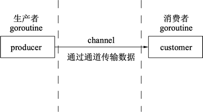

在早期CPU都是以单核的形式顺序执行机器指令。Golang语言的祖先C语言正式这种顺序的编程语言代表。顺序编程语言中的顺序是指：所有的指令都是以串行的方式执行，在相同的时刻有且仅有一个CPU在顺序执行程序的指令。

Golang语言正是在多核和网络化的时代背景下诞生的原生支持并发的编程语言。Golang语言从底层原生支持并发，无须第三方库，开发人员可以很轻松地在编写程序时决定怎么使用CPU资源。

Golang语言的并发是基于Goroutine的，Goroutine类似于线程，但并非线程。可以将Goroutine理解为一种虚拟线程。Golang语言在运行时会参与调度Goroutine，并将Goroutine合理地分配到每个CPU中，最大限度地使用CPU性能。

多个Goroutine中，Golang语言使用通道（channel）进行通信，通道是一种内置的数据结构，可以让用户在不同的Goroutine之间同步发送具有类型的消息。这让编程模型更倾向于在Goroutine之间发送消息，而不是让多个Goroutine争夺同一个数据的使用权。

程序可以将需要并发的环节设计为生产者模式和消费者模式，将数据放入通道。通道另外一断的代码将这些数据进行并发计算并返回结果，如下所示：



实例：生产者每秒生成一个字符串，并通过通道传递给消费者，生产者使用两个Goroutine并发运行，消费者在main()函数的Goroutine()
中进行处理

```go
package main

import (
	"fmt"
	"math/rand"
	"time"
)

// 数据生产者
func producer(header string, channel chan<- string) {
	// 无限循环, 不停地生产数据
	for {
		// 将随机数和字符串格式化为字符串发送给通道
		channel <- fmt.Sprintf("%s: %v", header, rand.Int31())
		// 等待1秒
		time.Sleep(time.Second)
	}
}

// 数据消费者
func customer(channel <-chan string) {
	// 不停地获取数据
	for {
		// 从通道中取出数据, 此处会阻塞直到信道中返回数据
		message := <-channel
		// 打印数据
		fmt.Println(message)
	}
}

func main() {
	// 创建一个字符串类型的通道
	channel := make(chan string)
	// 创建producer()函数的并发goroutine
	go producer("cat", channel)
	go producer("dog", channel)
	// 数据消费函数
	customer(channel)
}
```

对代码的分析：

第03行，导入格式化（fmt）、随机数（math/rand）、时间（time）包参与编译。

第10行，生产数据的函数，传入一个标记类型的字符串及一个只能写入的通道。

第13行，for{} 构成一个无限循环。

第15行，使用 rand.Int31() 生成一个随机数，使用 fmt.Sprintf() 函数将 header 和随机数格式化为字符串。

第18行，使用 time.Sleep() 函数暂停 1 秒再执行这个函数。如果在 goroutine 中执行时，暂停不会影响其他 goroutine 的执行。

第23行，消费数据的函数，传入一个只能写入的通道。

第26行，构造一个不断消费消息的循环。

第28行，从通道中取出数据。

第31行，将取出的数据进行打印。

第35行，程序的入口函数，总是在程序开始时执行。

第37行，实例化一个字符串类型的通道。

第39行和第40行，并发执行一个生产者函数，两行分别创建了这个函数搭配不同参数的两个goroutine。

第42行，执行消费者函数通过通道进行数据消费。

整段代码中，没有线程创建，没有线程池也没有加锁，仅仅通过关键字Go实现Goroutine，和通道实现数据交换。