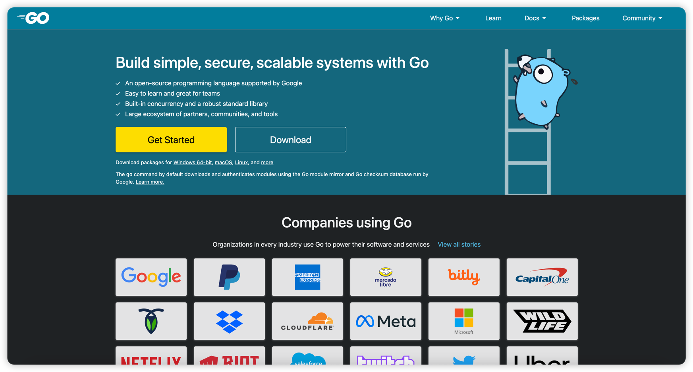
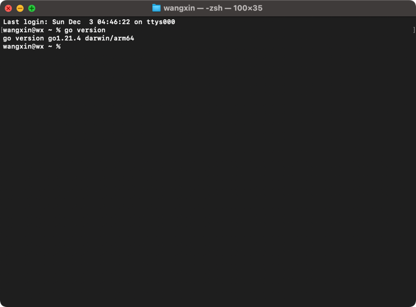

### 1.Golang语言的介绍

Go（又称Golang）是Google开发的一种静态强类型、编译型、并发型，并具有垃圾回收功能的编程语言。
罗伯特·格瑞史莫、罗勃·派克及肯·汤普逊于2007年9月开始设计Go，稍后伊恩·兰斯·泰勒（Ian Lance Taylor）、拉斯·考克斯（Russ
Cox）加入项目。Go是基于Inferno操作系统所开发的。Go于2009年11月正式宣布推出，成为开放源代码项目，支持Linux、macOS、Windows等操作系统。
在2016年，Go被软件评价公司TIOBE选为“TIOBE 2016年最佳语言”。 目前，Go每半年发布一个二级版本（即从a.x升级到a.y）。

Go的语法接近C语言，但对于变量的声明有所不同。Go支持垃圾回收功能。Go的并行计算模型是以东尼·霍尔的通信顺序进程（CSP）为基础，采取类似模型的其他语言包括Occam和Limbo，Go也具有这个模型的特征，比如通道传输。通过goroutine和通道等并行构造可以建造线程池和管道等。在1.8版本中开放插件（Plugin）的支持，这意味着现在能从Go中动态加载部分函数。

与C++相比，Go并不包括如枚举、异常处理、继承、泛型（此功能在go1.18中加入）、断言、虚函数等功能，但增加了切片(Slice)
型、并发、管道、垃圾回收、接口等特性的语言级支持。对于断言的存在，则持负面态度，同时也为自己不提供类型继承来辩护。

不同于Java，Go原生提供了关联数组（也称为哈希表（Hashes）或字典（Dictionaries））。

### 2.Golang语言的优势

- 语法简洁

> Go 语言提供了一套格式化工具——`go fmt`。一些 Go
> 语言的开发环境或者编辑器在保存时，都会使用格式化工具进行修改代码的格式化，这样就保证了不同开发者提交的代码都是统一的格式。Go
> 语言简单易学，学习曲线平缓，不需要像 C/C++ 语言动辄需要两到三年的学习期。Go
> 语言被称为“互联网时代的C语言”。Go 语言的风格类似于C语言。其语法在C语言的基础上进行了大幅的简化，去掉了不需要的表达式括号，循环也只有
> for 一种表示方法，就可以实现数值、键值等各种遍历。
> 代码风格统

- 代码风格统一

> Go 语言提供了一套格式化工具——go fmt，一些 Go 语言的开发环境或者编辑器在保存时，都会使用格式化工具进行修改代码的格式化，这样就保证了不同开发者提交的代码都是统一的格式。

- 开发效率高

> Go语言实现了开发效率与执行效率的完美结合，让你像写Python代码（效率）一样编写C代码（性能）。

### 3.Golang语言的环境搭建

- 下载Golang解释器

<a href="https:golang.dev" title="Golang官网地址">Golang官网地址</a>

官网截图：



- Linux系统安装

我们在版本选择页面选择并下载好`go1.21.4.linux-amd64.tar.gz`文件：

```shell
wget https://go.dev/dl/go1.21.4.linux-amd64.tar.gz
```

将下载好的软件解压到`/usr/local`目录下：

```shell
tar -zxvf go1.21.4.linux-amd64.tar.gz -C /usr/local  # 解压
```

如果提示没有权限，加上`sudo`以`root`用户的身份再运行。执行完就可以在`/usr/local/`下看到`go`目录了。

**配置环境变量：** Linux下有两个文件可以配置环境变量，其中/etc/profile是对所有用户生效的；$HOME/.profile是对当前用户生效的，根据自己的情况自行选择一个文件打开，添加如下两行代码，保存退出。

```shell
export GOROOT=/usr/local/go
export PATH=$PATH:$GOROOT/bin
```

修改`/etc/profile`后要重启生效，修改`$HOME/.profile`后使用`source`命令加载`$HOME/.profile`文件即可生效。 检查：



### 4.GOROOT和GOPATH

`GOROOT`和`GOPATH`都是环境变量，其中`GOROOT`是我们安装go开发包的路径，而从`Go 1.8`
版本开始，Go开发包在安装完成后会为`GOPATH`设置一个默认目录，并且在`Go1.14`及之后的版本中启用了`Go Module`
模式之后，不一定非要将代码写到`GOPATH`目录下，所以也就不需要我们再自己配置`GOPATH`了，使用默认的即可。

想要查看你电脑上的`GOPATH`路径，只需要打开终端输入以下命令并回车：

```shell
go env
```

在终端输出的内容中找到`GOPATH`对应的具体路径。

### 5.第一个程序

现在我们创建第一个Go项目——`main`。在我们桌面创建一个`main`目录。

**go mod init**

使用go module模式新建项目时，我们需要通过`go mod init`项目名命令对项目进行初始化，该命命令会在项目根目录下生成`go mod`
文件。例如，我们使用`main`作为我们第一个Go项目的名称，执行如下命令。

```shell
go mod init main
```

**编写代码**

接下来在该目录中创建一个`main.go`文件：

```shell
package main

import 'fmt'

func main(){
fmt.Println("Hello,World!")
}
```

**编译**

`go build`命令表示将源代码编译成可执行文件。在`main`目录下执行：

```shell
go build
```

编译得到的可执行文件会保存在执行编译命令的当前目录下，如果是Windows平台会在当前目录下找到`main.exe`
可执行文件。可在终端直接执行该`main.exe`文件：我们还可以使用`-o`参数来指定编译后得到的可执行文件的名字。

**go run**

`go run main.go`也可以执行程序，该命令本质上是先在临时目录编译程序然后再执行。

> 如果你不清楚关于`go run`执行机制的描述，那么你最好今后都使用`go build`编译再执行

**go install**

`go install`表示安装的意思，它先编译源代码得到的可执行文件，然后将可执行文件移动到`GOPATH`的`bin`目录下。因为我们把`GOPATH`
下的`bin`目录添加到了环境变量中，所以我们就可以在任意位置执行可执行文件了。