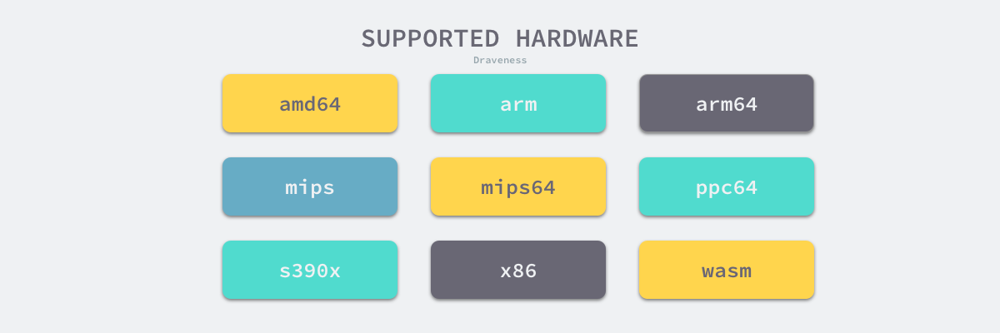

Go语言是一门需要编译才能运行的编程语言，也就是说代码在运行之前需要通过编译器生成二进制机器码，包含二进制机器码的文件才能在目标机器上运行，如果我们想了解Go语言的实现原理,理解它的编译过程就是一个没有办法绕过的事情。

-------


**抽象语法树**

抽象语法书(Abstract Syntax Tree、AST)，是源代码语法的结构的一种抽象表示，它用树桩的方式表示编程语言的语法结构。抽象语法树种的每一个节点都表示源代码种的一个元素，每一颗子树的表示一个语法元素，以表达式`2 * 3 + 7`为例，编译器的语法分析阶段会生成如下图所示的抽象语法树。



作为编译器常用的数据结构，抽象语法树抹去了源代码中不重要的一些字符-空格、分号或者括号等。编译器在执行完语法分析之后会输出一个抽象语法树，这个抽象语法树会辅助编译器进行语义分析，我们可以用它来确定语法正确的程序是否存在一些类型不匹配的问题。

-------

**静态单赋值**

静态单赋值(Static Single Assignment、SSA）是中间代码的特性，如果中间代码具有静态单赋值的特性，那么每个变量就只会被赋值一次。在实践中，我们通常会用下标实现静态单赋值，这里以下面的代码举个例子：

```go
x := 1
x := 2
y := x
```

经过简单的分析，我们就能够发现上述的代码第一行的赋值语句`x := 1`不会起到任何作用。下面是具有SSA特性的中间代码，我们可以清晰地发现变量`y_1`和`x_1`是没有任何关系的，所以在机器码生成时就可以省去`x := 1`的赋值，通过减少需要执行的指令优化这段代码。

```go
x_1 := 1
x_2 := 2
y_1 := X_2
```

因为SSA的主要作用是对代码进行优化，所以它是编译器后端的一部分；当然代码编译领域除了SSA还有很多中间代码的优化方法，编译器生成代码的优化也是一个古老并且复杂的领域。

**指令集**

很多开发者都会遇到在本地开发环境编译和运行正常的代码，在生产环境却无法正常工作，这种问题背后有多重原因，而不同机器使用的不同指令集可能是原因之一。

我们大多数开发者都会使用x86_64的MacBook作为工作上主要使用的设备，在命令行中输入`uname -m`就能获得当前机器的硬件信息：

```shell
$ uname -m
x86_64
```

x86是目前比较常见的指令集，除了x86之外，还有ARM等指令集，苹果最新MacBook的自研芯片就使用了ARM指令集，不同的处理器使用了不同的架构和机器语言，所以很多编程语言为了在不同的机器上运行需要将源代码根据架构翻译成不同的机器代码。

复杂指令集计算机(CISC)和精简指令集计算机(RISC)是两种遵循不同设计理念的指令集，从名字上我们就可以推测出两种指令集的区别：

- 复杂指令集：通过增加指令的类型减少需要执行指令数；
- 精简指令集：使用更少的指令类型完成目标的计算任务；

早期的CPU为了减少机器语言指令的数量一般使用复杂指令集完成计算任务，这两者并没有绝对的优劣，它们只是在一些设计上的选择不同以达到不同的目的。

**编译原理**

Golang语言编译器的源代码在`src/cmd/compile`目录中，目录下的文件共同组成了Golang语言的编译器，学过编译原理的人可能听说过编译器的前端和后端，，编译器的前端一般承担着词法分析、语法分析、类型检查和中间代码生成几部分工作，编译器后端主要负责代码的生成和优化，也就是将中间代码翻译成目标机器能够运行的二进制机器码。



Golang的编译器在逻辑上可以被分成四个阶段：词法与语法分析、类型检查和AST转换、通用SSA生成和左后的机器代码生成。

**词法与语法分析**

所有的编译过程其实都是从解析代码的源文件开始的，词法分析的作用就是解析源代码文件，它将文件中的字符串序列转换成Token序列，方便后面的处理和解析，我们一般会把执行词法分析的程序称为词法解析器(lexer)。

而语法分析的输入是词法解析器输出的Token序列，语法分析器会按照顺序解析Token序列，该过程会将词法分析生成的Token按照编程语言定义好的文法(Grammar)自下而上或者自上而下的规约，每一个Golang的源代码文件最终会被归纳陈个SourceFile结构：

```go
SourceFile = PackageClause ";" {ImportDecl ";"}{TopLevelDecl ";"}
```

词法分析会返回一个不包含空格、换行等字符的Token序列，例如：`package`、`json`、`import`等，而语法分析会把Token序列转换成有意义的结构体，即语法树：

```go
"json.go": SourceFile{
    PackageName: "json",
    ImportDecl: []Import{
        "io",
    }
    TopLevelDecl: ...
}
```

Token到上述抽象语法树(AST)的转换过程会用到语法解析器，每一个AST都对应着一个单独的Golang语言文件，这个抽象语法树种包括当前文件属于的包名、定义的常亮、结构体和函数等。

> Golang语言的语法解析器使用的是LALR的文法

语法解析的过程中发生的任何语法错误都会被语法解析器发现并将消息打印到标准输出上，整个编译过程也会随着错误的出现而被中止。

**类型检查**

当拿到一组文件的抽象语法树之后，Golang语言的编译器会对语法树中定义和使用的类型进行检查，类型检查会按照以下的顺序分别验证和处理不同类型的节点：

    1.常量、类型和函数名及类型；
    2.变量的赋值和初始化；
    3.函数和闭包的主体；
    4.哈希键值对的类型；
    5.导入函数体
    6.外部的声明；

通过对整个抽象语法树的遍历，我们在每个节点上都会对当前子树的类型进行验证，以保证节点不存在类型错误，所有的类型错误和不匹配都会在这一个阶段被暴露出来，其中包括：结构体对接口的实现。

类型检查阶段不止会对节点的类型进行验证，还会展开和改写一些内奸的函数，例如make关键字在这个阶段会根据子树的结构被替换成`runtime.makeslice`或者`runtime.makechan`等函数。



类型检查这一过程在整个编译流程中还是非常重要的，Golang语言的很多关键字都依赖类型检查期间的展开和改写。

**中间代码生成**

当我们将源文件转换成抽象语法树、对整棵树的语法进行解析并进行类型检查之后，就可以认为当前文件中的代码不存在语法错误和类型错误的问题了，Golang语言的编译器就会将输入的抽象语法树转换成中间代码。

在类型检查之后，编译器会通过`cmd/compile/internal/gc.compileFunctions`编译整个Golang语言项目中的全部函数，这些函数会在一个编译队列中等待几个Goroutine的消费，并发执行的Goroutine会将所有函数对应的抽象语法树转换成中间代码



由于Golang语言编译器的中间代码使用了SSA的特性，所以在这一阶段我们能够分析出代码中的无用变量和片段并对代码进行优化。

**机器码生成**

Golang语言源代码的`src/cmd/compile/internal`目录中包含了很多机器码生成相关的包，不同类型的CPU分别使用不同的包生成机器码，其中包括ARM、ARM64、AMD64、mips、MIPS64、ppc64、s390x、x86和wasm，其中比较有趣的
的就是WebAssembly(Wasm)了。

作为一种在栈虚拟机使用的二进制指令格式，它的设计的主要目标就是在web浏览器上提供一种具有高可移植性的目标语言。Golang语言的编译器既然能够生成Wasm格式的指令，那么就能够运行在常见的主流浏览器中。

```Shell
$ GOARCH=wasm GOOS=js go build -o lib.wasm main.go
```

我们还可以使用上述的命令将Golang的源代码编译成能够在浏览器上运行WebAssembly文件，当然除了这种新兴的二进制指令格式之外，Golang语言经过编译还可以运行在几乎全部的主流机器上，不过它的兼容性在除Linux和Darwin之外的机器上可能还有一些问题，例如：Go Plugin至今仍然不支持Windows。



### 编译器入口

Golang语言的编译器的入口在`src/cmd/compile/internal/gc/main.go`文件中，其中600多行的`cmd/compile/internal/gc.Main`
就是Golang语言编译器的主程序，该函数会先获取命令行传入的参数并更新编译选项和配置，随后会调用`cmd/compile/internal/gc.parseFiles`
对输入的文件进行词法与语法分析得到对应的抽象语法树：

```Go
func Main(archInit func (*Arch)){
···
lines := parseFiles(flags.Args())
}
```

得到抽象语法树后会分成9个阶段对抽象语法树进行更新和编译，就像我们在上面介绍的，抽象语法树会经历类型检查、SSA中间代码生成以及机器码生成三个阶段：

    1.检查常量、类型和函数的类型；
    2.处理变量的赋值；
    3：对函数的主体进行类型检查；
    4.决定如何捕获变量；
    5.检查内联函数的类型；
    6.进行逃逸分析；
    7.将闭包的主体转换成引用的捕获变量；
    8.编译顶层函数；
    9.检查外部依赖的声明；

对整个编译过程有一个顶层的认识之后，我们重新回到词法和语法分析后的具体流程，在这里编译器会对生成语法树中的节点进行执行类型检查，除了常量、类型和函数这些顶层声明之外，它还会检查变量的赋值语句、函数主体等结构：

```Go
for i := 0; i < len(xtop); i++ {
		n := xtop[i]
		if op := n.Op; op != ODCL && op != OAS && op != OAS2 && (op != ODCLTYPE || !n.Left.Name.Param.Alias) {
			xtop[i] = typecheck(n, ctxStmt)
		}
	}

	for i := 0; i < len(xtop); i++ {
		n := xtop[i]
		if op := n.Op; op == ODCL || op == OAS || op == OAS2 || op == ODCLTYPE && n.Left.Name.Param.Alias {
			xtop[i] = typecheck(n, ctxStmt)
		}
	}
	...
```

类型检查会遍历传入节点的全部子节点，这个过程会展开和重写`make`
等关键字，在类型检查会改变语法树种的一些节点，不会生成新的变量或者语法树，这个过程的结束也意味着源代码中不存在语法和类型错误，中间代码和机器码都可以根据抽象语法树正常生成。

```Go
initssaconfig()

peekitabs()

for i := 0; i < len(xtop); i++ {
n := xtop[i]
if n.Op == ODCLFUNC {
funccompile(n)
}
}

compileFunctions()

for i, n := range externdcl {
if n.Op == ONAME {
externdcl[i] = typecheck(externdcl[i], ctxExpr)
}
}

checkMapKeys()
}
```

在主程序运行的最后，编译器会将顶层的函数编译成中间代码并根据目标的CPU架构生成机器码，不过在这一阶段也有可能会再次对外部依赖进行类型检查以验证其正确性。

